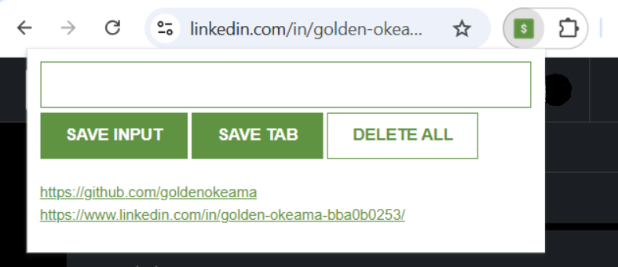

# Leads Tracker Chrome Extension

A simple and efficient Chrome Extension for saving and managing web URLs (or "leads").

It allows users to quickly save the current tab's URL or manually input any other URL, storing them persistently using the browser's local storage.

---



---

## ✨ Features

- **Save Current Tab:** A dedicated button to grab and save the URL of the currently active browser tab.
- **Manual Input:** An input field to manually type and save any URL or custom text.
- **Persistent Storage:** Leads are stored in **`localStorage`**, meaning they persist even after the browser is closed and reopened.
- **Linkable List:** Saved leads are displayed as clickable links that open in a new tab.
- **Delete All:** A safety-checked "DELETE ALL" button (requires a double-click) to clear all saved leads from storage.

---

## 💻 Tech Stack

- **HTML:** For the basic structure of the extension's popup.
- **CSS:** Minimal styling to make the extension look clean and accessible.
- **JavaScript:** The core logic, handling DOM manipulation, local storage operations, and interaction with the Chrome Tabs API.

---

## 🚀 Installation and Usage

### 1. Installation

This extension is not published on the Chrome Web Store. To install it, you need to load it unpacked:

1.  **Download/Clone the Repository:**
    ```bash
    git clone https://github.com/goldenokeama/leads-tracker-chrome-extension
    ```
2.  **Open Chrome Extensions Page:** Open your Google Chrome browser and navigate to `chrome://extensions`.
3.  **Enable Developer Mode:** Toggle the **Developer mode** switch in the top-right corner.
4.  **Load Unpacked:** Click the **"Load unpacked"** button and select the folder containing your extension files.
5.  **Pin the Extension:** Click the puzzle piece icon next to your profile picture, and click the **pin** icon next to "Leads Tracker" to keep it easily accessible on your toolbar.

### 2. Usage

1.  **Save Current Tab:**
    - Navigate to the webpage you want to save.
    - Click the **"SAVE TAB"** button in the extension popup.
2.  **Save Manual Input:**
    - Type or paste a URL into the input field.
    - Click the **"SAVE INPUT"** button.
3.  **View Leads:**
    - Click the extension icon. All your saved links will appear in the list below the buttons.
    - Click any link to open it in a new tab.
4.  **Delete All Leads:**
    - **Double-click** the **"DELETE ALL"** button to permanently clear all stored leads.
